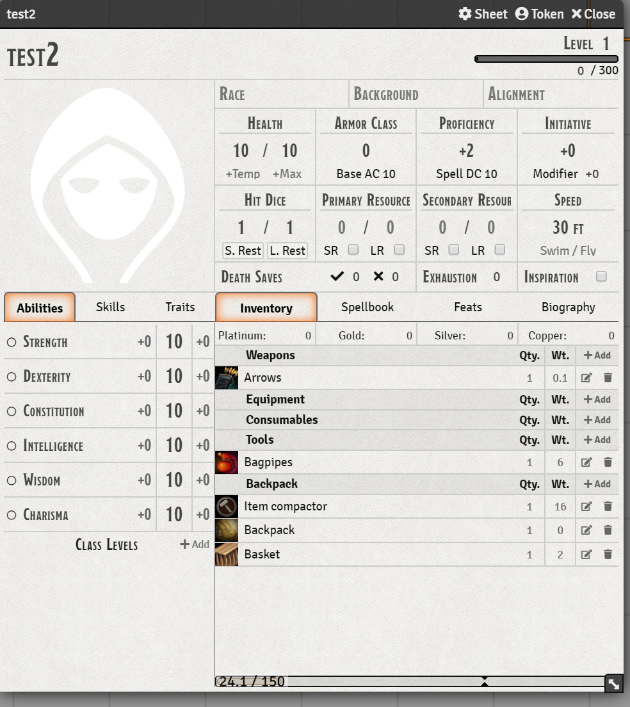
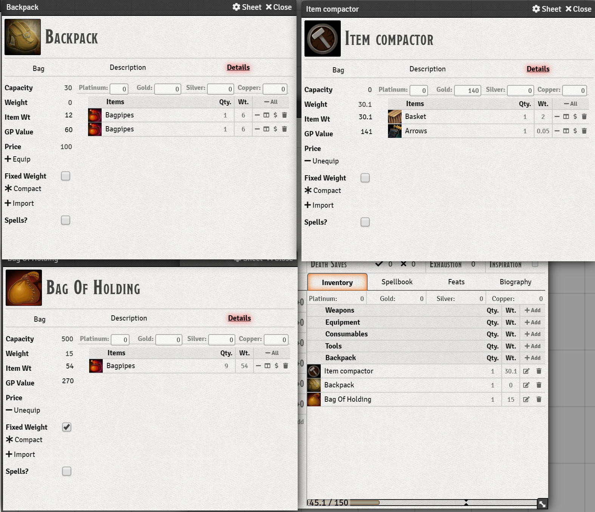
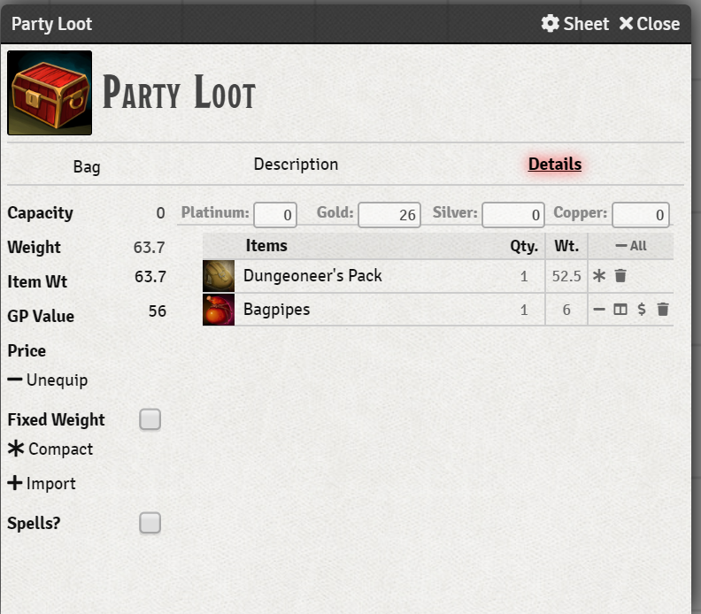
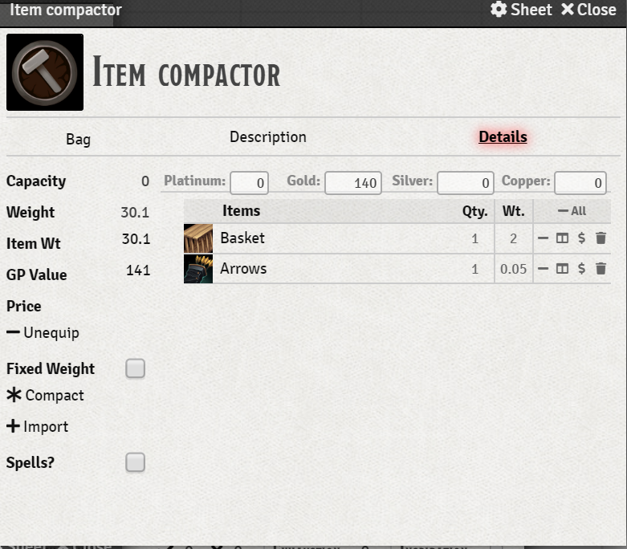
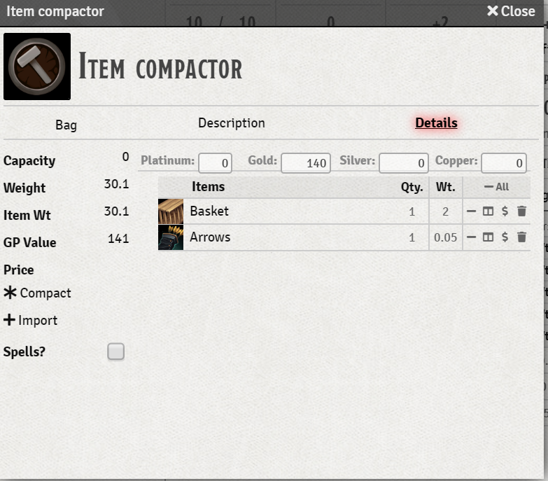

This module provides Items that are capable of holding other items; e.g. bags.  

For **foundry 0.8.4** or later you must install via module.json and use:
```
https://gitlab.com/tposney/itemcollection/raw/08x/package/module.json
```
The 0.8.x version as been an almost complete rewrite of the module, so there might be some teething issues. Notable changes:
* item weight is correctly updated in the actor inventory as items are added/deleted.
* Gold value and item price is updated correctly.
### v1.3.4
You must uninstall and reinstall the module to get the latest version if you are on a version before 1.3.4

### Version 1.2.10 Comaptible with 0.4.5 and dnd0.80.
1. No specific migration strep required from 0.4.3
2. Added a feature that allows you to always add ropes, lanterns and mess kits to bags (they are tied on the side). The weight of the bag will include the item's weight. Thanks to @BrotherSharp for the idea.
3.  See notes section if you receive "Bags must be of type backpack" error messages.
4. Includes ja.json localization. Thanks to @Asami for the translations.


### Main features:

Bags are backpack items (so can go anywhere a backpack item can, inventory, compendium, world items) and hold other items.

-  
- Bags can contain any "items" (including spells, feats and other bags). Items can be added to a bag via drag and drop or the import button (which brings in the entire inventory). Items can be removed from a bag via drag and drop to a character inventory, bag, item directory or compendium according to permissions. Items can be exported to you inventory via buttons on the bag sheet.
- Bags have a capacity indicating how much they can hold. A capacity of 0 means infinite. This can only be set by the GM. If you try and drop an from a bag or character inventory into a bag that is too heavy for the bag it will be added to your inventory instead.
- Bags can be set to a fixed weight (as used in the encumberance calculation), think bag of holding (capacity 500, fixed weight 15) or a mule (fixed weight 0, capacity 690). 
- Bags can be unequipped by players or GM, so that their reported weight drops to 0 in your inventory (only bags with a capacity other than 0 can be unequipped).
- 
- You can create bags of standard equipment, e.g. adventurer's pack which can be dragged onto a character and imported into the inventory. The module ships with a sample compendium of a few bags that you might find useful.
- At the GM's discretion (.e.g. module setting) items in bags can be converted to gold at a certain percentage of their value (another setting). The GM can choose to enable this when the party gets to a town to let them easily sell off accumulated loot.
- Bags can hold any item, including spells, classes and features so that you can create spellbooks, e.g. cleric 1st level spells that can be dragged onto a character imported, also class starter packs with class, feats, spells and equipment.
- Items in bags can be compacted - did you find 20 different sets of armour in you treasure pile? Use the compact function to convert them to one line of 20 sets of armour. If you over compact items in a bag there is a split operation to separate them.
- The GM can create a world entity party loot item (which is a bag) and drop treasure or treasure bags If the player characters have owner permission to the party loot item they can drag and drop to/from it to take the things they want. They can also compact/split/convert to gold items in the party loot item. If they have observer permission they can see what is in it but not drag/drop etc. 
- The * next to the Dungeoneer's pack below  indicates it is a bag and pressing on it will pull items out of the pack into the party loot inventory list. You can leave them as loot parcels as well.
- 
- Player characters can be given a copy of the "Item Compactor" (a zero capacity non-unequip-able item) that will let them manage their inventory without hiding their total item weight.
- A per client module option allows you to have items in bags sorted. This allows you to import your inventory/spellbook and export it again to have a sorted ivnentory/spellbook.
- Due to my ineptitude ONLY bags ownd by Actors or unowned can be editied. To change such a bag drag it to the items directory, change it there and drag back to the token.
- Items dragged from a characters inventory and dropped into a bag are deleted from the characters inventory, so that character only has a single copy of the item.


### Notes
- The UI is pretty rough at the moment, it will be improved.
- If you get the message "Bags must be of type backpack" the item has the item5eSheetWithBags set as its sheet but it is not a backpack. If you have a backpack from a previous version and you get this message, it is of type loot. You need to convert it to type backpack.
- Copy it to the sidebar and then run ```Itemcollection.convertToBackpack("item name")``` from the console or as a macro

- When you drag an item from a bag it is **immediately** deleted from the bag. If you drop it somewhere that cannot receive it, it will **disappear** from the game. This means that dragging/dropping from bags does not create new items in the game. A better programmer would work out how to delete the item only on drop.
- Due to the changes in 0.4.x backpack items are not displayed for npcs. This will no doubt change, however if you are brave you can patch
    
Data/systems/dnd5e/module/actor/sheets/npc.js and change lines 43-50 from (note the added comma at the end of the equipment line)
```
// Categorize Items as Features and Spells
    const features = {
      weapons: { label: "Attacks", items: [] , hasActions: true, dataset: {type: "weapon", "weapon-type": "natural"} },
      actions: { label: "Actions", items: [] , hasActions: true, dataset: {type: "feat", "activation.type": "action"} },
      passive: { label: "Features", items: [], dataset: {type: "feat"} },
      equipment: { label: "Inventory", items: [], dataset: {type: "loot"}}
    };
```

to

```
    // Categorize Items as Features and Spells
    const features = {
      weapons: { label: "Attacks", items: [] , hasActions: true, dataset: {type: "weapon", "weapon-type": "natural"} },
      actions: { label: "Actions", items: [] , hasActions: true, dataset: {type: "feat", "activation.type": "action"} },
      passive: { label: "Features", items: [], dataset: {type: "feat"} },
      equipment: { label: "Inventory", items: [], dataset: {type: "loot"}},
      containers: {label: "Containers", items: [], dataset: {type: "backpack"}}
    };
```


If worrying about encumbrance is not your idea of fun, just give players a capacity 0, fixed weight 0 item or two and they can just push equipment around to their heart's content.

### libWrapper

This module uses the [libWrapper](https://github.com/ruipin/fvtt-lib-wrapper) library for wrapping core methods. It is a hard dependency and it is recommended for the best experience and compatibility with other modules.

### Installation Instructions

To install a module, follow these instructions:
Easiest solution is to install from the foundry modules page.

Or

1. [Download the zip](https://gitlab.com/tposney/itemcollection/raw/master/itemcollection.zip) file included in the module directory, or paste the url for the module.json into the install maodule option.
2. Extract the included folder to `public/modules` in your Foundry Virtual Tabletop installation folder.
3. Restart Foundry Virtual Tabletop.  
4. Since this module includes a compendium of items the first time you run foundry will complain and not let you open the compendium. Simply restart foundry a second time and all should be good.
5. To create a bag from scratch, simple create any backpack item then set its iemsheet to be ItemSheet5eWithBags and all the necessary data will be created. I very strongly recommend that you **ONLY** do this for items you want to have as bags since once added the data is there forever. 

Or

Use this URL to install via the module isntallation menu in Foundry: "https://gitlab.com/tposney/itemcollection/raw/master/package/module.json"
Once you have a bag (or drag one from the pre-created ones) the gm will see something like this. Players will only see the options available to them.



The - next to the item exports the single item to the characters inventory if the items is owned by a character.

The -Unequip checkbox will unequip the item from your inventory (setting its weight to 0), it wont remove it.

The *Compact button compacts all items into a single line with the correct quantity. For spells, there is no quantity, so this acts as deduplicate. Since the list is always sorted you can use this to tidy up your spell book. 

Normally the weight of the bag updates as you add/delete items (currency weight is included according to the game setting). A GM can set the item to Fixed Weight and enter a weight in the adjacent weight field which is what will be shown in the inventory/encumberance. It is not a good idea to give players a fixed weight item with capacity 0 (unlimited) since this allows them to keep as much equipment as they like.

Items can be dragged into or out of the bag. Be careful when dragging out of the bag since the item is immediately removed from the bag when you start the drag. If you change your mind make sure to drop the item back into the bag or it will disappear.

The "two panel" icon next to the "-" is the split item command. If there is more than 1 of the items in the bag it will be split (evenly) to create 2 items with half the quantity each. Useful in the party loot when several players want some of the item.

The players view is slightly different: They cannot set the capacity of the bag, or set it to fixed weight. Notice also that the -Unequip button is not displayed as this item is not owned by the character.

The $ sign converts the item to GP at the module configured setting percentage. The dollar sign only appears if the module setting is enabled. The players view below is slightly different as some functions are disabled, notably setting capacity and fixed weight. Also, in the example below unequip is disabled since the bag has a capacity of 0.




### Creating a bag

Create an item which must be of type backpack and change it's item sheet sheet to ItemSheet5eWithBags. Then edit the item.


- This is an **beta** release and whilst I have done quite a bit of testing it is quite possible that something will go wrong and trash your items. I **strongly** suggest you try this out in a test world first and make sure you can do what you want. I also strongly suggest you make a backup of you world directory before you start playing.
- I will investigate making items editable for the next release but it may require a substantial change to the code.
- There are two modules flags that are set at world level, can you convert items to gold and what percentage of the value is added to the bag when conversion is done. These are world flags so can only be set by the GM.
- There is a sort bag contents flag as well, which is settable by each user. Items are sorted by type (weapon, spell etc), then name. Spells are also sorted by level.
- As a GM when creating packs for characters set the capacity to 0 until you have everything in the bag, then set the capacity to either whatever their starter pack would be (i.e. 30 for a normal backpack) or a small value, such as 0.1 which means they can take things out of the starter pack but not put things back in, effectively an extract only pack.

### Bugs


- The mod is not very chatty about refusing to accept dropped items, there are a few error messages displayed on the user screen.

- Item export is quite slow for inventories of many items. This is a side effect of having to await each add from the inventory and my ineptitude at working out how to do it faster.

- There is a bug that setting an item to fixed weight is not immediately reflected in the total weight. Simply unequip/equip to update.

- Because there are many item create when exporting the actors table gets updated much more often. This can make the system a little slow when the actors table gets very full. Importing does not suffer have the same problem.

- There is some incompatibility with [foundry-vtt-dnd5e-types](https://github.com/League-of-Foundry-Developers/foundry-vtt-dnd5e-types) but should be fixed on the future

### Feedback

If you have any suggestions or feedback, please contact me on discord @tposney

## Acknowledgements

Bootstrapped with League of Extraordinary FoundryVTT Developers  [foundry-vtt-types](https://github.com/League-of-Foundry-Developers/foundry-vtt-types).

Bootstrapped with League of Extraordinary FoundryVTT Developers  [foundry-vtt-dnd5e-types](https://github.com/League-of-Foundry-Developers/foundry-vtt-dnd5e-types).

Mad props to the 'League of Extraordinary FoundryVTT Developers' community which helped me figure out a lot.


